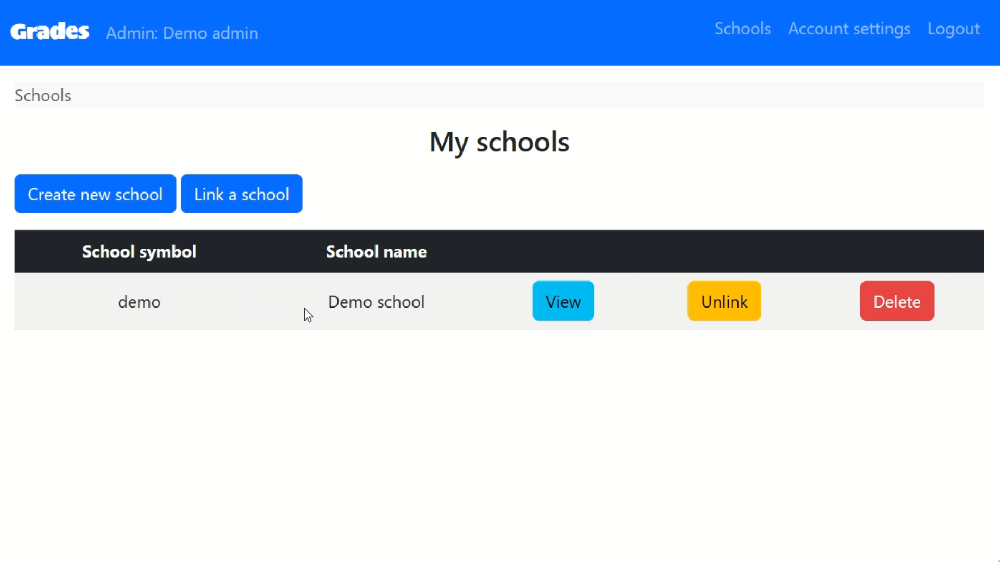
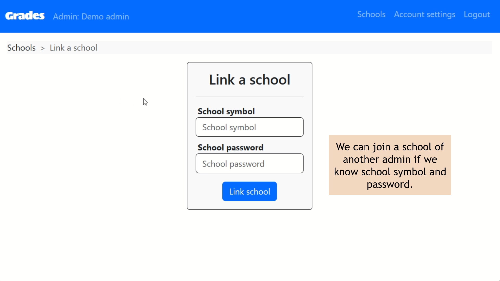
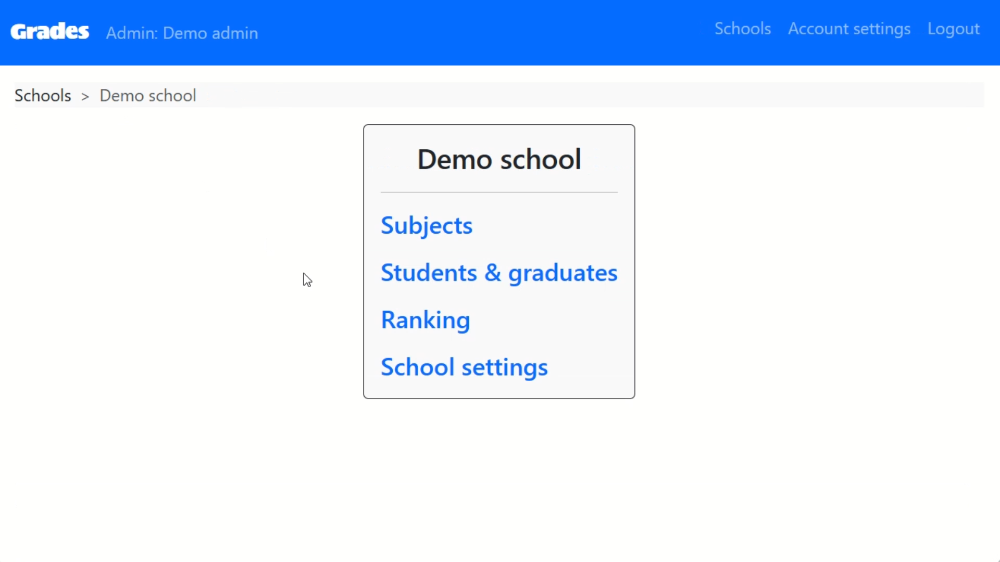
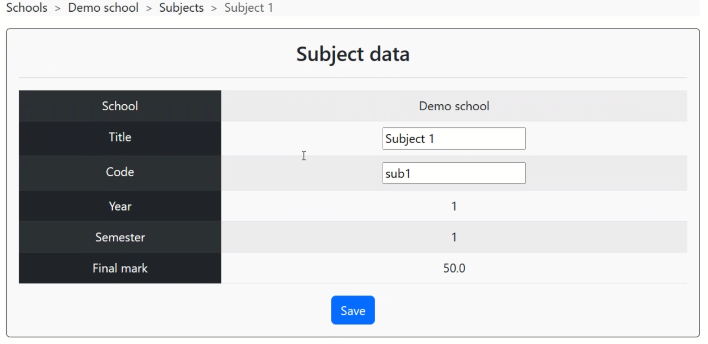
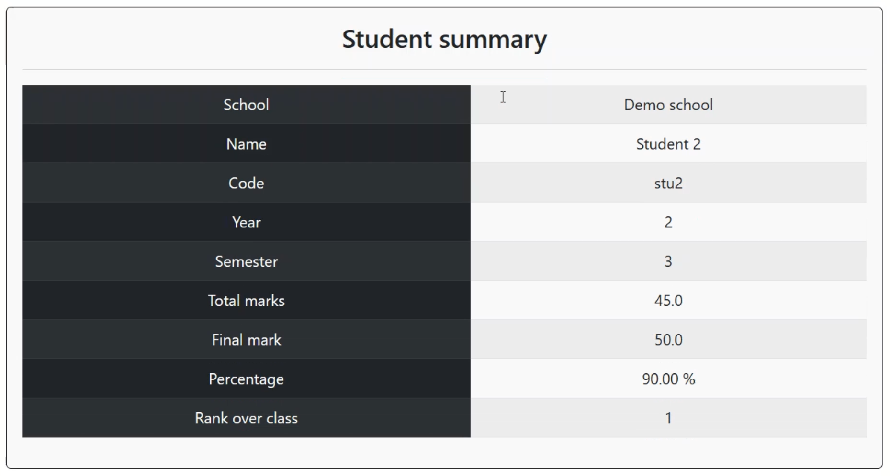
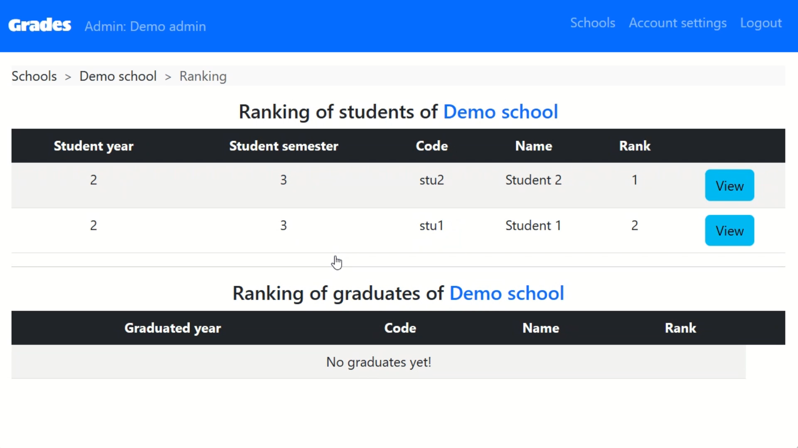

تطبيق **Grades** هو تطبيق ويب يمكّن مسؤلي المدارس من إدارة درجات الطلاب في المواد الدراسية المختلفة.

## لقطات الشاشة
  

  

**هذا فيديو توضيحي للمشروع:**


## دوري في هذا المشروع
لقد كان تطبيق Grades واحدا من أوائل تطبيقات الويب التي صنعتها على الإطلاق. قمت بتخطيط وتصميم وتنفيذ المشروع من الصفر فيما يقارب الثلاثة أسابيع لإخراجه على صورته الحالية. هذا المشروع متوفر حاليا باللغة الإنجليزية فقط لأني قدمته كمشروع التخرج في الدورة التقديمية لعلوم الحاسب المقدمة من جامعة هارفارد. لمعرفة المزيد عن تفاصيل المشروع ووظائفه يمكنك زيارة [النسخة الإنجليزية]() من هذه الصفحة.