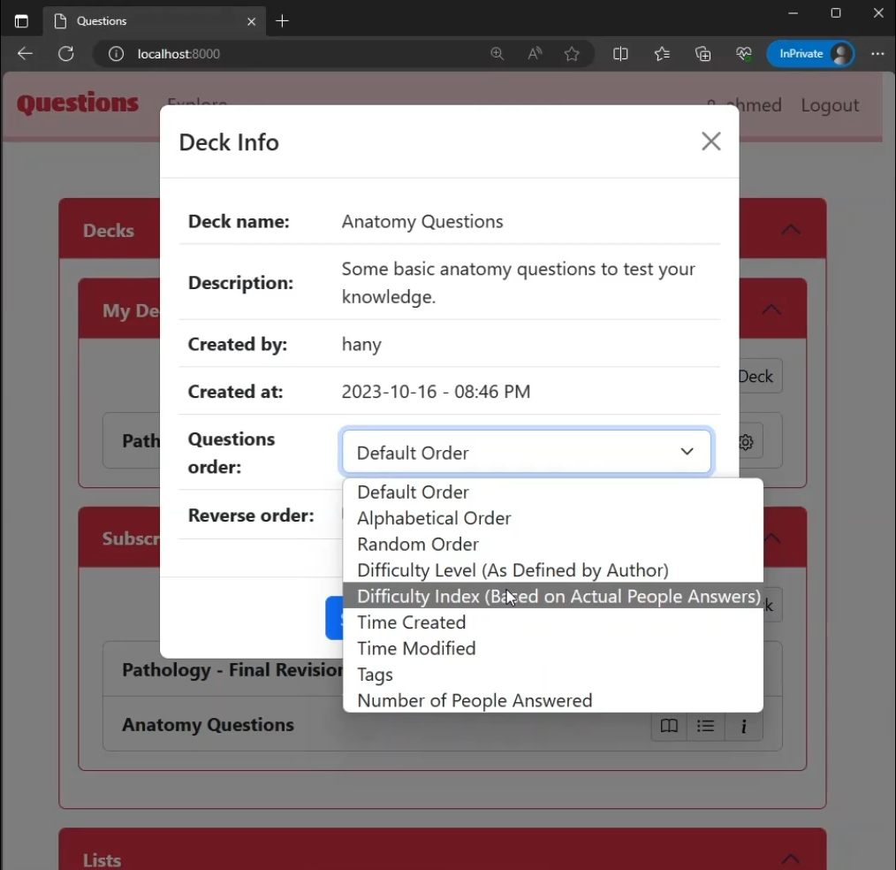

تطبيق **Questions** هو تطبيق ويب يتيح للمستخدمين دراسة الأسئلة التي قاموا بإنشائها بأنفسهم أو تمت مشاركتها بواسطة مستخدمين آخرين.

## لقطات الشاشة
  

 

**هذا فيديو توضيحي للمشروع:**


## دوري في المشروع
لقد وضعت تصورا للمشروع وقمت بتصميمه وتنفيذه من الصفر. استغرق الأمر مدة تزيد عن شهر من العمل حتى أتممته على الصورة الحالية.
المشروع متوفر حاليا باللغة الإنجليزية فقط لأني قدمته كمشروع التخرج في دورة تطوير الويب المقدمة من جامعة هارفارد. لمعرفة المزيد عن تفاصيل المشروع ووظائفه يمكنك زيارة [النسخة الإنجليزية]() من هذه الصفحة أو تجربة التطبيق في العرض الحي.