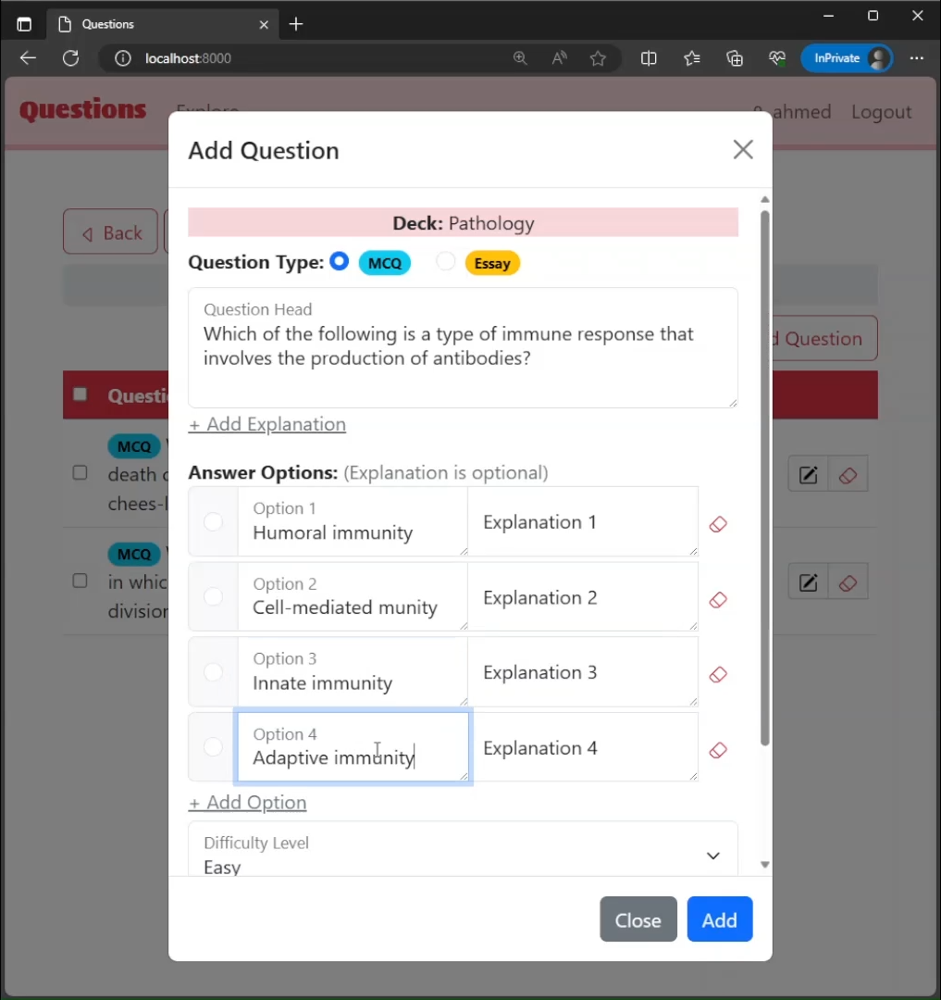
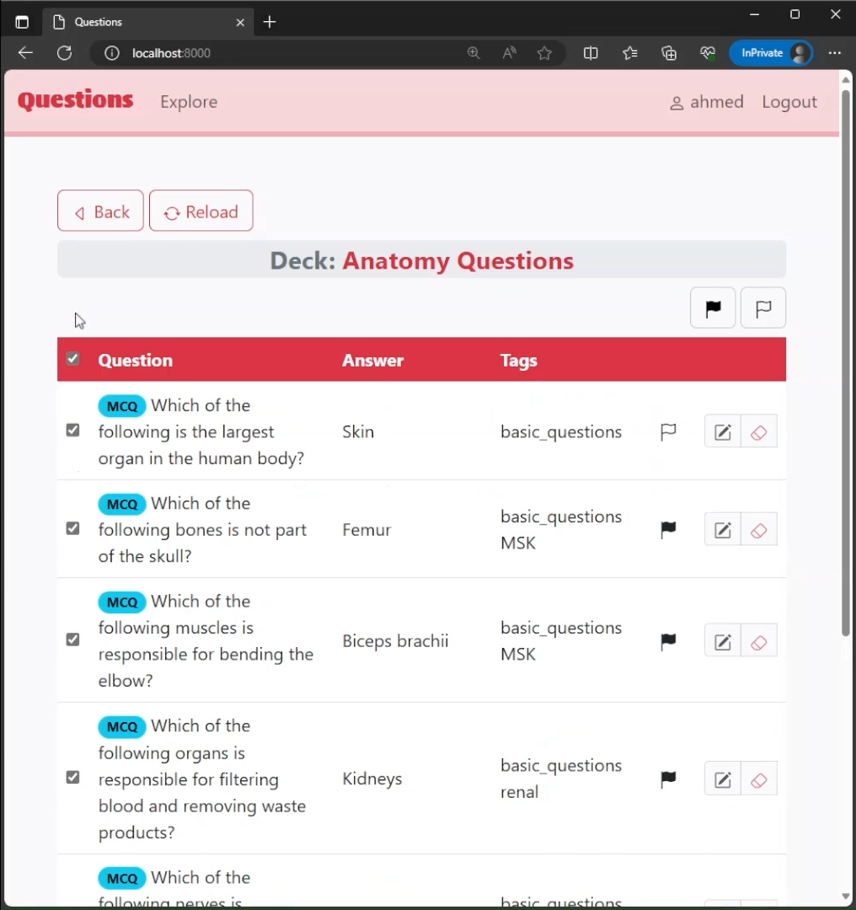
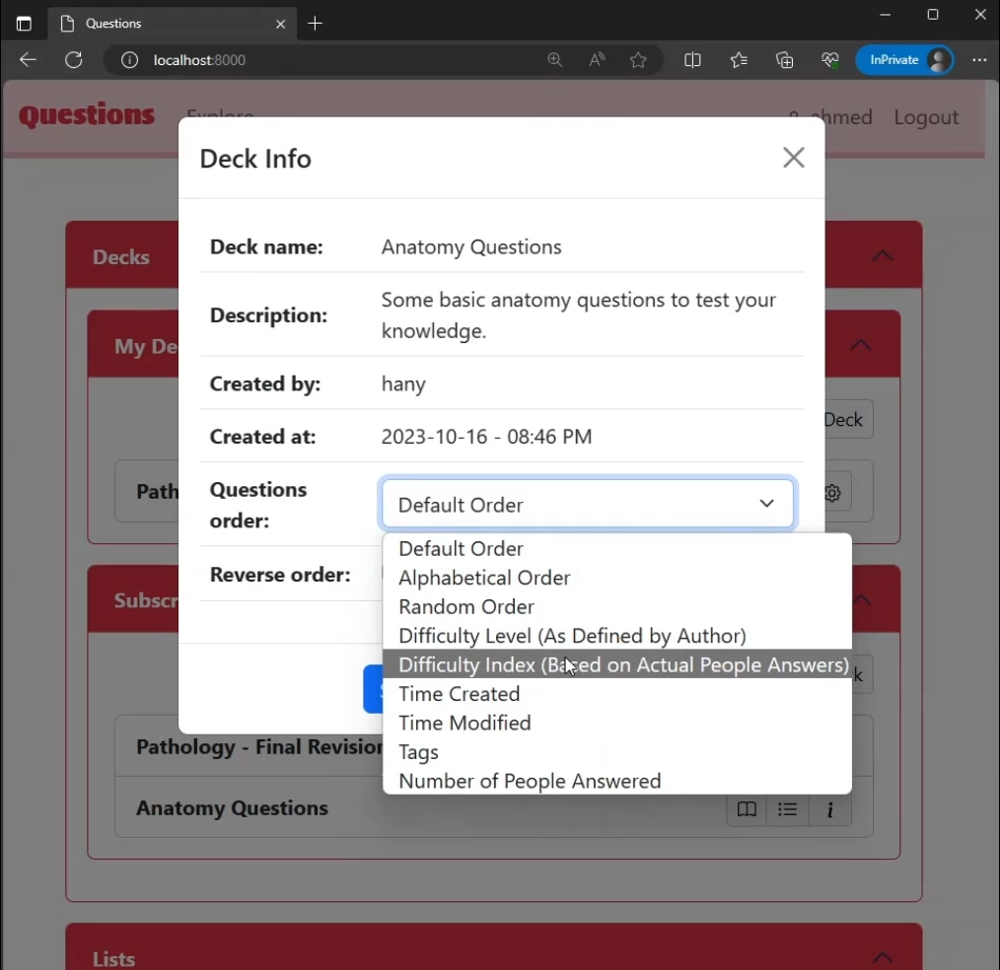
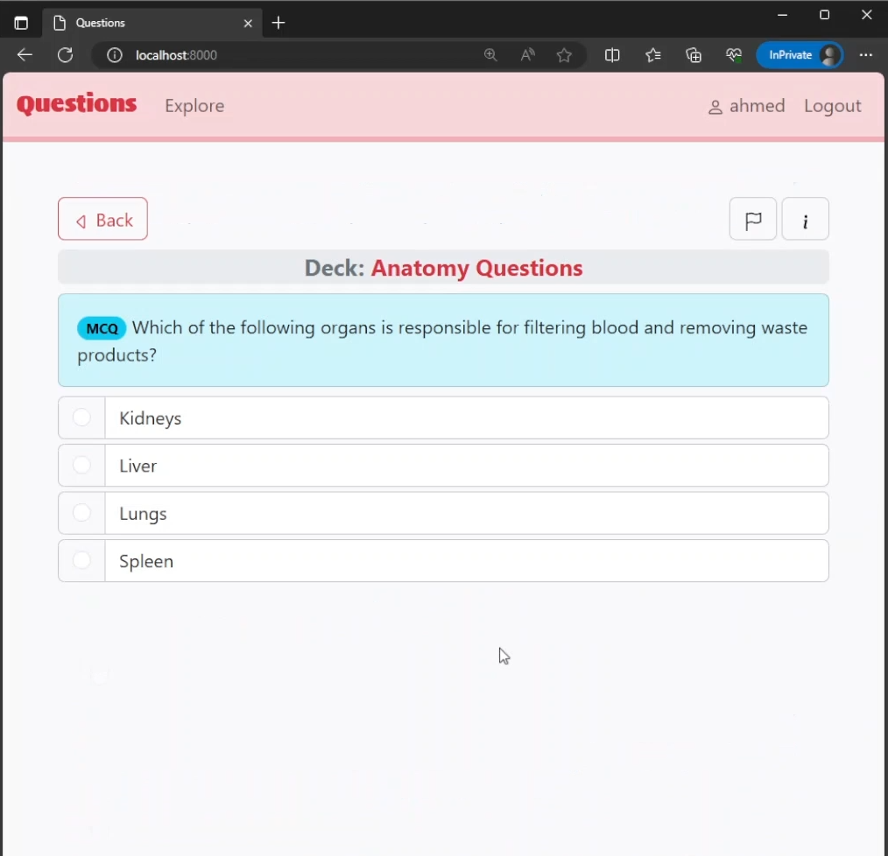

**Questions** is a webapp that allows users to study questions that they themselves create or get shared by other users.

## Screenshots
  

 

**Here is a walkthrough video of the project:**


## My Role in This Project
I have conceptualized, designed and fully implemented this project from scratch. I submitted it as my graduation project CS50's Web Programming with Python and JavaScript course provided by Harvard. It took over a month of work to complete, and it was one of the earliest projects I've created using Django.

#### Technologies Used:
- Django Rest Framework
- Python
- JavaScript
- HTML, CSS, Bootstrap

## Complexity
Questions can do fine tuning of some behaviors, which imply a fairly complex logic and code under the hood.
- Many users can subscribe to a single deck, while each having their own study progress and preferences that are different from other subscribers to the same deck.
- The author of the deck is the only one who can make changes like adding or removing questions, while these changes are being delivered to subscribers but in a read-only manner, which ensures a good control over the deck by the author while still having the ability to share and make other benefit.
- Users can subscribe of the decks in different ways including a public access via the explore window, and a private access link which the author can share with people they want. The point here is that the method by which a user has subscribed to a deck is stored in the database, so that if the author decided to turn off one method, all users subscribed via it will be revoked, while subscribers via the other one will still have access to the deck.
- While creating or editing MCQ questions, there isn't a rigid number of choices or answer options the author can stick to. Instead, the author can add any number of answer options they want from two upwards. The point here is that he possible behaviors and misbehaviors that the author can do is dealt with properly, making the app smarter and more convenient and easier to use. For example, user cannot submit a question if it has only one answer option, or if the author tries to say that an empty answer option is the correct option, or if the author writes an explanation on an empty answer option. Also, if the author provides five options, for example, but only three of them are not empty, the app will deal with that and store only the non-empty options. All these scenarios are dealt with both at the time of creation and editing of MCQs, and both at the level of the front-end and back-end.
- Relating models to each other is structured in a logical way that achieves the desired purpose of the app effectively while preserving the ability to build upon and add new models and relations that serve new features and capabilities to the app in future improvement and updates without making huge alteration of models.
## Features
#### Organization
- Questions are organized by different means including decks, tags, and lists.
	- **Decks** are the basic containers that contain questions. A question cannot be outside a deck. A question cannot belong to multiple decks.
	- **Tags** can be assigned to questions. Each question can have one or more tags. A single tag can be assigned to more than a question. Tags provide a more flexible means of organization in comparison with decks.
	- **Lists** are collection of questions where you can collect questions from different decks, bypassing the boundaries of decks.
#### Sharing
- Users can share decks either publicly or via an access link.
- **Public sharing.** Decks that are shared publicly can be explored and subscribed to by other users.
- **Sharing via access link.** Decks that are shared via access link can be accessed by users who have this link.
- Both of those ways can be present simultaneously for a single deck.
- If the creator decided to disable the access link or turn the deck unpublic, all users subscribed to this deck will be revoked.
- If a the creator adds or removes questions to or from the shared deck, all subscribers will get those changes.
- Answers submitted by users subscribed to deck are stored and used to calculate a **difficulty index** each question based on how correct or wrong it was answered. The more the users answer a question, the more accurate the difficulty index for this question becomes. One way to make use of this difficulty index is by studying questions in the order of difficulty, so that users can focus on the difficult or tricky questions.
- When a user answers an MCQ, they are given a feedback about the number and percentage of people who chose each answer option.
#### Questions
- Questions webapp supports Multiple Choice Questions (MCQs) and Essay Questions.
- **MCQs**
	- MCQs are questions that require you to select the correct answer option from a given list of options.
	- MCQs can have a flexible number of options. Each question can have 2 or more options without an upper limit, to allow for a flexible usage. 
	- There must be a single correct answer option.
	- Each answer option can optionally have an explanation that appear after the user answers the questions, in addition to the ability to add an explanation for the question as a whole.
- **Essay Questions**
	- Essay Questions are open ended, in a simple question & answer manner. In addition, user can optionally add an explanation to the question which may provide some extra information about the question or answer. 
- **Flags**. A question can be flagged. Flag can provide a way of marking the question for some purpose.
- **Difficulty level**. Each question can have a difficulty level assigned by the author of the question which helps grouping the questions into different groups of difficulty. Difficulty level are easy, medium, and hard. 
- **Difficulty level vs difficulty index.** Difficulty level is defined by the author of the question as described above, while difficulty index is calculated based upon actual user answers.
#### Studying
- **Order methods.** Users can study questions in different methods of ordering, including:
	- **Default order.** The order of adding the questions to the deck or list.
	- **Random order**.
	- **Alphabetical order:** ordering questions heads alphabetically.
	- **Difficulty level**. (described before)
	- **Difficulty index.** (described before)
	- **Time created.**
	- **Time modified**.
	- **Tags.**
	- **Number of People Answered.** which can help access questions that are less frequently answered, which helps improving accuracy of calculation of difficulty index.
- **Reverse order.** Each method of ordering can be reversed allowing studying in a descending order which helps more flexible access to questions. 
- **Study progress** is tracked so that when a user gets to study a deck or a list, they continue from where they left off. There is an option to reset this progress and restudy the deck or the list from the start.
#### Other Features
- Decks and Lists can optionally have a description where the creator can describe what they need.
