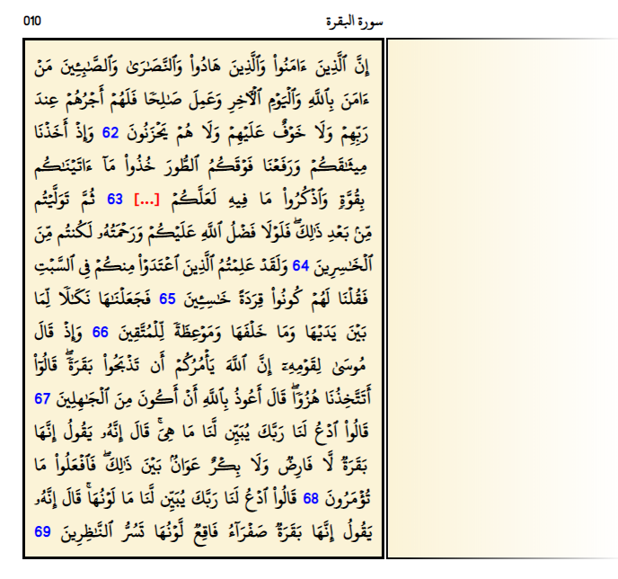
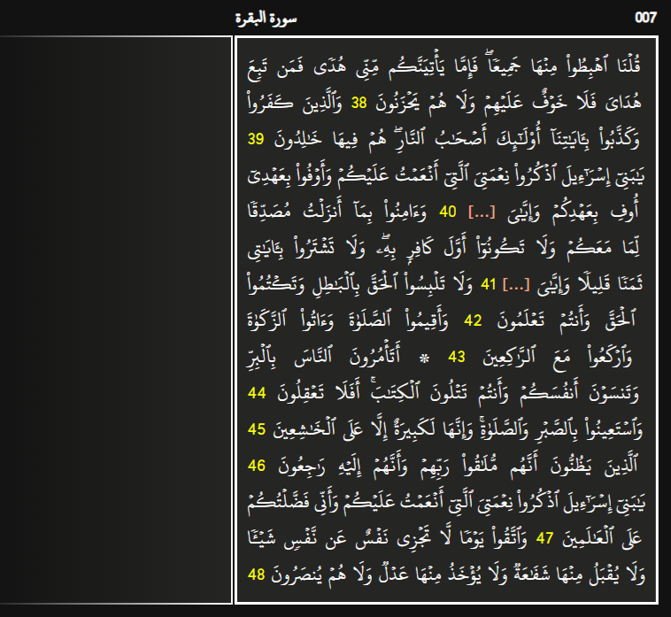
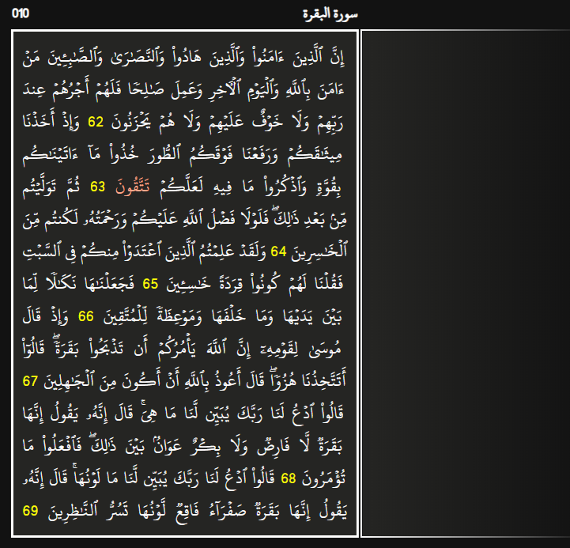

رزمة QuranCloze هي رزمة أنكي (Anki deck) تحتوي صفحات القرآن الكريم معدة بشكل يسمح للمستخدم بأن يقوم بإنشاء بطاقات من نوع ملء الفراغات (Cloze) ومراجعتها بسهولة.

## المزايا
- تحتوي الرزمة على 604 ملحوظة (Note) بعدد صفحات المصحف الشريف، ولكنها لا تحتوي أي سؤال مبدئيا، فعلى المستخدم أن يقوم بإنشاء أسئلة للكلمات أو الآيات التي يريد مراجعتها، وذلك بأن يقوم بتحديد النص الذي يريده وهو معد مسبقا، ثم الضغط على زر [...] لإخفاء النص المحدد.
- بعدما يجيب المستخدم على أي بطاقة، تظهر له الصفحات السابقة والصفحات التالية للموضع الذي راجعه في هذه البطاقة، حتى يتسنى له النظر في سياق الآيات إذا احتاج إلى ذلك.
- هناك تحسينات بصرية وتمييز لأرقام الآيات واتجاه الصفحة يمينًا أو يسارًا، وغير ذلك، وهذا يساعد الذاكرة البصرية، وهناك أيضا دعم للوضع الداكن.
- الرزمة منظمة باستخدام الوسوم (Tags)، وهناك وسوم لأجزاء القرآن الكريم، ووسوم أخرى للسور.

## لقطات الشاشة

