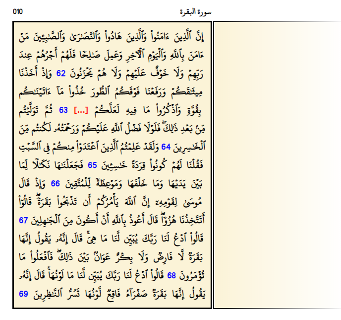

**QuranCloze** is an Anki deck that contains all pages of The Noble Quran, designed in a way that simplifies the process of creating cloze flashcards and studying them.  

## Features
- The deck initially contains 604 notes, exactly as the number of Quran pages, however, there isn't yet any cards (i.e. no actual questions). User's role is to select the text that they would like to study then clicking the [...] button to create new cards.
- After the user answers a question, a number of previous and following pages to the current page appear, so that the user can review the context of current question if they need.
- There is visual enhancement and discrimination of the direction of the Quranic page, either a right or a left page, which aids the visual memory. Dark mode is also supported.
- The deck is organized by tags. There are tags for both Surahs and Juz's.

## Screenshots

