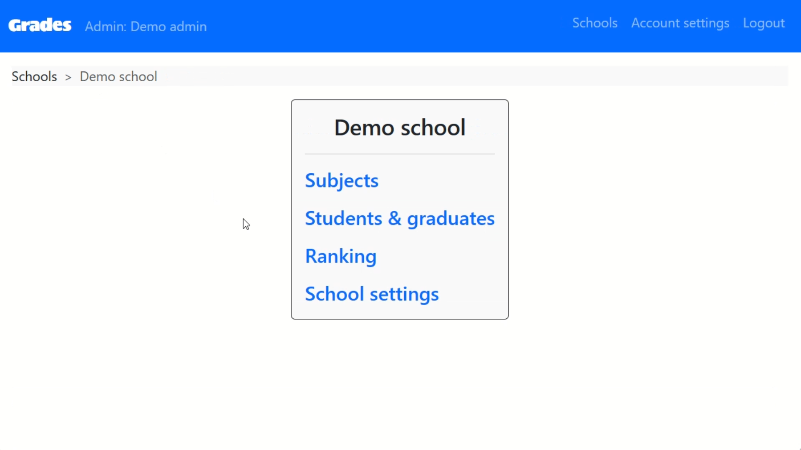

**Grades** is a webapp that allows school admins to manage marks of school students in different school subjects.

## Screenshots
  

  

**Here is a walkthrough video of the project:**


## My Role in This Project
Grades was one of the earliest webapps I've ever made! I have conceptualized and designed it from scratch as part of my graduation project of CS50's Introduction to Computer Science provided by Harvard University. It took me around three weeks to complete it to reach the current stage.

#### Technologies used:
- Flask Framework
- Python
- SQLite
- HTML, CSS, Bootstrap

## Features

#### Admin-Side Features:

- School Management:
    - Admins can sign up and create new schools or join existing ones using a unique symbol and password.
    - Each school has distinct settings including name, symbol, password for admin collaboration, number of school years, and semesters per year.

- Subject Management:
    - Admins can define subjects with details such as title, code, final mark, and the year-semester combination.
    - Easily modify subject settings, including deletion.

- Student Information:
    - Student details include name, code, current year-semester, and a secure username/password for individual logins.
    - Admins can manage student data, including modifications and deletions.

- Academic Tracking:
    - Grades calculates and tracks total marks, percentages, grades, and class ranks for each student.

- Flexible Modifications:
    - Admins can make adjustments to various settings, including account details, school configurations, subject details, and student data.

- Secure Account Management:
    - Admins have the capability to modify account settings, ensuring a secure and personalized experience.

#### Student-Side Features:

- Individual Access:
    - Students can log in using their unique username and password to access and view their marks.

- Comprehensive Mark View:
    - Grades provides a detailed breakdown of student marks, year-semester information, and overall academic performance. 
